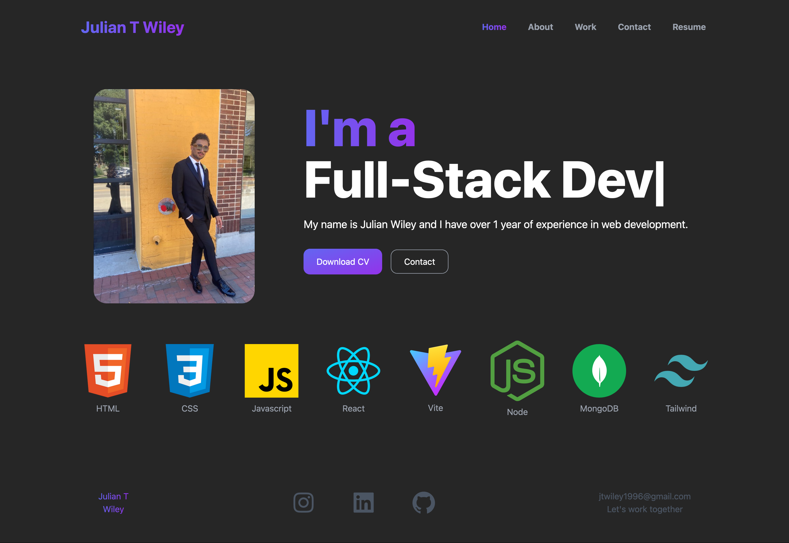

# MyWorkPortfolio
 
 
 

## Description

Crafting this project was pivotal for me as it served as a canvas to apply and solidify the web design skills I've diligently refined over recent months. A pivotal goal was to construct a polished portfolio to flaunt during job applications.

I invested considerable time and effort to ensure that my portfolio not only exudes aesthetic appeal but also adeptly portrays my skills and accomplishments. I meticulously curated various projects from my bootcamp journey, providing a comprehensive glimpse into my capabilities. Mastering the integration of React and Tailwind CSS was paramount, enabling me to fashion a dynamic and visually captivating website. Moreover, successfully deploying my portfolio to Netlify expanded my repertoire of deployment techniques.

## Usage

Experience My Portfolio firsthand by clicking below:

[Portfolio Link](https://julianwiley-portfolio.netlify.app/)
<!----------------------------------------------------------------------------->
[Portfolio Link]: # 'Take a tour!'
<!---------------------------------[ Buttons ]--------------------------------->
[Click me]: https://img.shields.io/badge/Click%20me%20-%23F59120?style=for-the-badge

